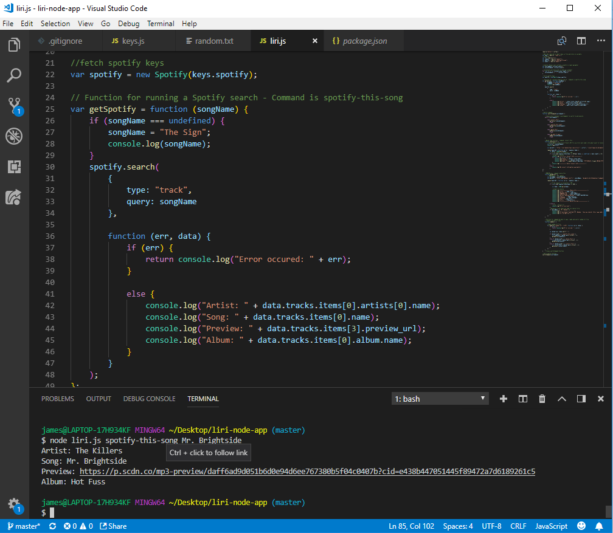
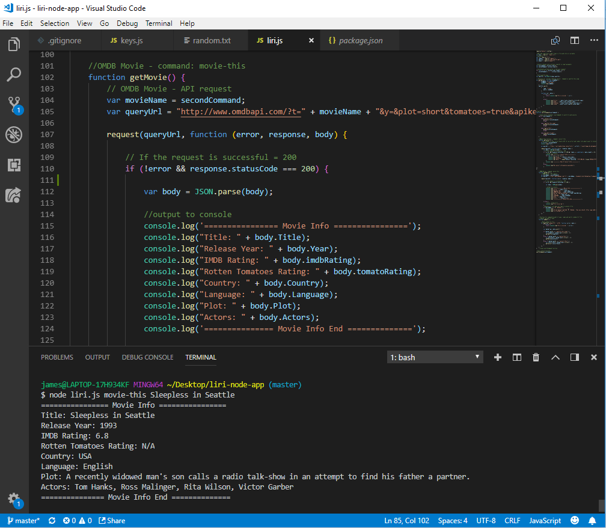
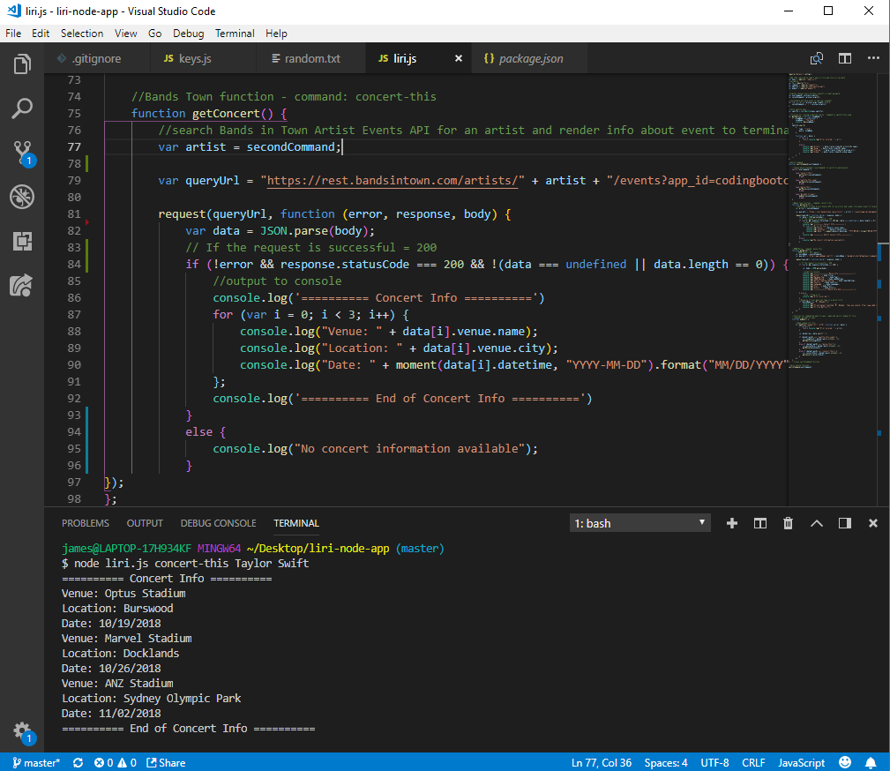
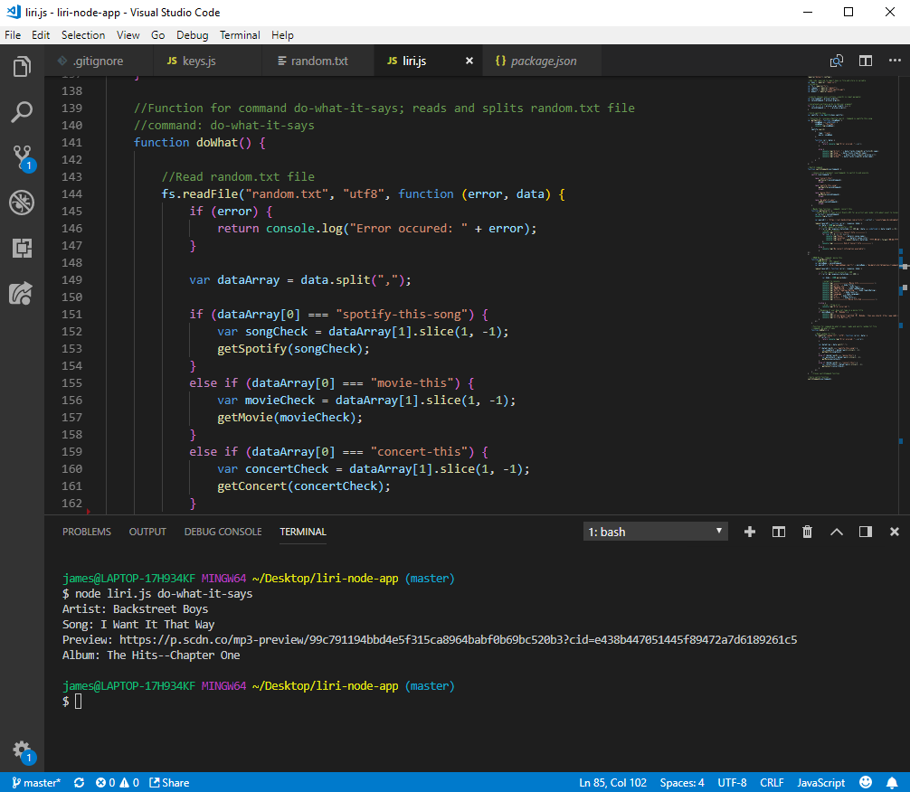

# LIRI Bot  :computer:

## LIRI -- Language Interpretation and Recognition Interface

###A command line node app that takes in parameters and gives you back data

LIRI uses the following commands:
    
    * "spotify-this-song" returns:
          * Artist(s)
          * Song Name
          * Song preview link from Spotify
          * Album song is from
    * "movie-this" returns:
          * Movie title
          * Release year
          * IMDB rating
          * Rotten Tomatoes rating
          * Country where movie was produced
          * Language
          * Plot
          * Actors
    * "concert-this" returns:
          * Venue Name
          * Venue Location
          * Date of Event
    * "do-what-it-says":
          * runs one of the previous commands using text from the random.txt file
        
 
 Technologies used:
  
     * Node.js
     * Javascript
     * npm packages: spotify, request, moment, dotenv
     * APIs: OMDB, Bands in Town
     
     
 How to run LIRI Bot in your terminal (examples):
 
 1. run "node liri.js spotify-this-song Mr. Brightside"
 
 
 2. run "node liri.js movie-this Sleepless in Seattle"
 
 
 3. run "node liri.js concert-this Taylor Swift"
 
 
 4. run "node liri.js do-what-it-says"
 

 
 
 
 
 
 
    

  
